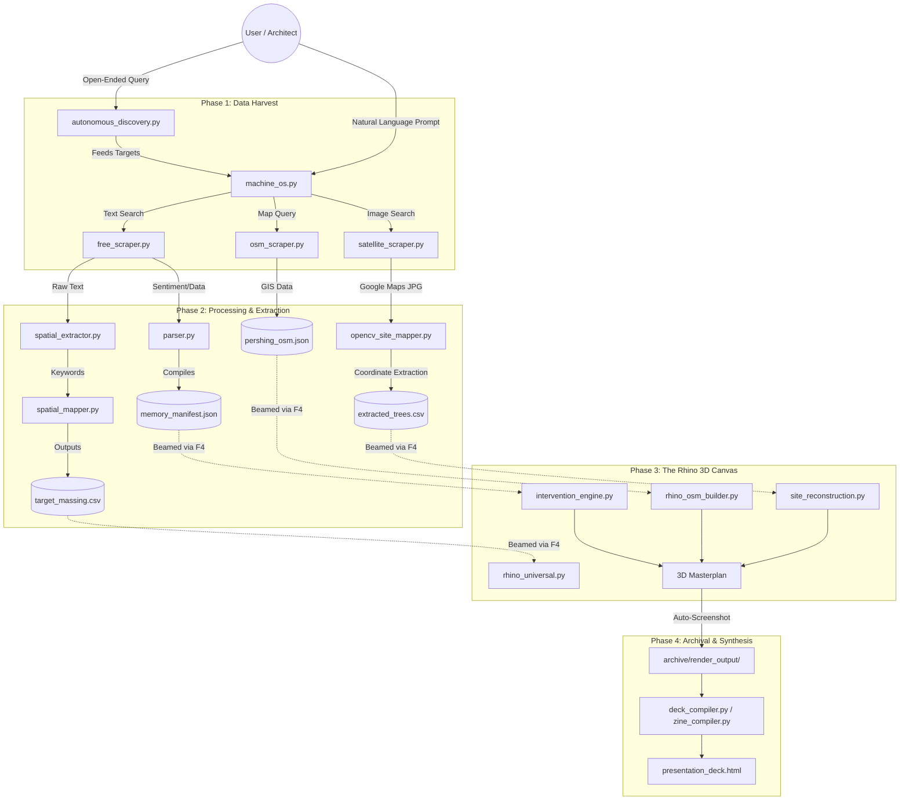

# 🧠 Memory Machine // System Architecture & Workflow

The Memory Machine is an autonomous generative pipeline. It extracts qualitative "memories" and quantitative "spatial data" from the internet, parses them using AI and Computer Vision, and translates them into procedural 3D architecture inside Rhinoceros 3D. Finally, it compiles these results into a digital presentation zine.

---

## 🌊 The Pipeline Flowchart

*(If you are viewing this in VS Code, install the "Markdown Preview Mermaid Support" extension, or view it on GitHub to see the visual diagram).*

---

## ⚙️ The Four Phases Explained

### 1. Data Harvest (The Senses)
This phase is how the machine gathers information from the outside world. It runs entirely in your VS Code terminal.
*   **`machine_os.py`**: The central brain. You type a prompt, and Gemini AI extracts the target building and location.
*   **`autonomous_discovery.py`**: The scout. You give it a vibe ("Cool plazas in Europe"), and it hunts the web to find specific locations to feed back into the OS.
*   **`free_scraper.py`**: Scrapes Wikipedia and DuckDuckGo for text history and memories.
*   **`satellite_scraper.py`**: Uses Playwright (a headless browser) to invisibly visit Google Maps and screenshot the site from above.
*   **`osm_scraper.py`**: Hits the OpenStreetMap API to download surrounding building footprints and heights.

### 2. Processing & Extraction (The Brain)
Raw data is messy. This phase translates text and pixels into math that Rhino can understand.
*   **`spatial_extractor.py`**: Reads the scraped text and strips away the noise, keeping only architectural keywords (brick, glass, tower, tree).
*   **`spatial_mapper.py`**: Turns those keywords into a highly structured `.csv` blueprint (e.g., if it reads "tree" 5 times, it writes a rule to generate 5 trees).
*   **`opencv_site_mapper.py`**: Uses Computer Vision to scan the Google Maps screenshot, isolate green pixels, and calculate exact X/Y coordinates for the existing trees.
*   **`memory_manifest.json`**: The central repository. Every scraped memory and architectural vibe is saved here as a "Node" waiting to be deployed.

### 3. The Rhino 3D Canvas (The Hands)
This is where the math becomes physical. These scripts use `rhinoscriptsyntax` and **must be run inside Rhino** (using the F4 VS Code bridge).
*   **`site_reconstruction.py`**: Draws the "canvas." It builds the concrete bounds, carves out the underground garage and ramps, builds existing monuments, and plants the trees found by OpenCV.
*   **`rhino_osm_builder.py`**: Builds the city. It reads the GPS footprints and extrudes the context buildings surrounding the site.
*   **`intervention_engine.py`**: The architect. It reads the master `memory_manifest.json` and procedurally generates new, high-fidelity interventions (pavilions, fountains, etc.) on top of the base site.
*   *(Case Studies)*: Scripts like `rhino_bottega.py` or `generate_trailer_88.py` are standalone deep-dives for specific memories.

### 4. Archival & Synthesis (The Output)
The final step packages everything for human consumption.
*   **Auto-Screenshots**: At the end of the Rhino scripts, the machine automatically snaps a 1920x1080 picture of the 3D viewport and saves it to the `archive/` folder.
*   **`deck_compiler.py` & `zine_compiler.py`**: These scripts read your generated text, JSON logic, and 3D screenshots, and dynamically write an HTML/CSS file.
*   **`digitalPalimpsest.html`**: The final product. A stylized, glitching, highly curated digital zine that proves the machine's work.

---

## 🚀 Standard Operating Sequence
If you want to run the entire pipeline from scratch, you execute them in this exact order:

1. **Discover & Scrape** (Terminal)
   `python logic\machine_os.py`
   `python logic\satellite_scraper.py`
   `python logic\osm_scraper.py`
2. **Process** (Terminal)
   `python logic\opencv_site_mapper.py`
3. **Build** (Press F4 in VS Code -> Beams to Rhino)
   Beam `site_reconstruction.py`
   Beam `rhino_osm_builder.py`
   Beam `intervention_engine.py`
4. **Publish** (Terminal)
   `python logic\deck_compiler.py`